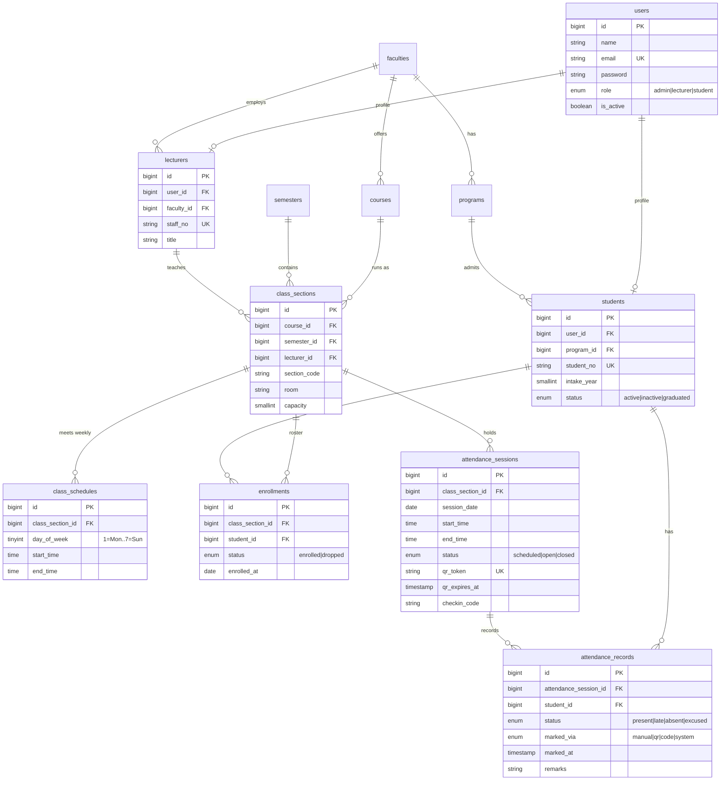

# Student Attendance Management System
### East Asia Management University (EAMU)

A Laravel 13 + MySQL application for running student attendance end to end: an
**administrator** sets up the academic structure and rosters, a **lecturer** takes
the register (by hand or by projecting a rotating QR code students scan), and a
**student** tracks their own attendance percentage against the university's 75%
requirement.

---

## Requirements

| Component | Version used |
|---|---|
| PHP | 8.5 (8.3+ required) |
| Composer | 2.x |
| MySQL / MariaDB | MariaDB 10.4 (XAMPP) |
| Node / npm | **not needed** - Bootstrap 5 is served from a CDN, there is no asset build |

Required PHP extensions: `pdo_mysql`, `mbstring`, `openssl`, `iconv`, `dom`,
`xmlwriter`, `zip`. QR codes are rendered as **SVG**, so neither `gd` nor
`imagick` is required.

---

## Setup

**1. Create the database**

```bash
mysql -u root -e "CREATE DATABASE individualAssignment CHARACTER SET utf8mb4 COLLATE utf8mb4_unicode_ci;"
```

On XAMPP for Windows the client lives at `C:\xampp\mysql\bin\mysql.exe`.

**2. Install dependencies**

```bash
composer install
```

Copy `.env.example` to `.env` if it does not already exist, then confirm the
database block reads:

```
DB_CONNECTION=mysql
DB_HOST=127.0.0.1
DB_PORT=3306
DB_DATABASE=individualAssignment
DB_USERNAME=root
DB_PASSWORD=
```

**3. Generate a key**

```bash
php artisan key:generate
```

**4. Migrate and seed**

```bash
php artisan migrate:fresh --seed
```

**5. Run it**

```bash
php artisan serve
```

Open <http://localhost:8000>. (`composer setup` runs steps 2-4 in one command.)

---

## Demo accounts

Every seeded account uses the password **`password`**.

| Role | Email | What they can do |
|---|---|---|
| Administrator | `admin@eamu.edu` | Everything: faculties, programs, courses, semesters, staff, students, class sections, rosters, reports, accounts |
| Lecturer | `v.meas@eamu.edu` | Their own classes only - open sessions, project the QR code, mark and close registers |
| Lecturer | `c.nou@eamu.edu` | As above, for a different set of classes |
| Student | `kosal.tep@student.eamu.edu` | Their own attendance only - percentages, history, self check-in |

The seeder prints a fresh list of accounts when it finishes.

**Seeded data:** 4 faculties, 6 programs, 10 courses, 2 semesters, 6 lecturers,
60 students, 10 class sections, ~320 sessions and ~6,000 attendance records -
including 7 students deliberately seeded below the 75% threshold so the at-risk
report is populated on first run.

---

## Features

### Administrator
- CRUD for faculties, programs, courses, semesters, lecturers, students and class sections
- Class sections carry a **weekly timetable**, which lecturers use to bulk-generate a semester of sessions
- Roster management with bulk enrollment and a searchable student picker
- Account administration - reset a password, deactivate or reactivate a user
- Reports: university-wide overview, per class section, per student, and an **at-risk list** of everyone below the threshold

### Lecturer
- Dashboard of today's classes with one-click **Open** for check-in
- Register marking screen: present / late / absent / excused per student, per-student remarks, and mark-everyone shortcuts
- **Closing a session auto-marks every unmarked student absent** in a single statement
- Projected **QR kiosk** with a live check-in feed
- Per-class attendance report with date-range filtering

### Student
- Dashboard with overall percentage, per-class breakdown, and a warning when below 75%
- Self check-in by scanning the QR code or typing the six-character code
- Full session-by-session history for each class

---

## How the QR check-in works

1. The lecturer opens a session. The system mints a 64-character token plus a
   six-character human-readable code, valid for 60 seconds.
2. `/lecturer/sessions/{id}/qr` displays a full-screen kiosk: a large SVG QR code,
   the six-character code, a countdown, and live present/late counters.
3. The page polls `/qr/refresh` every 45 seconds. Each poll **rotates the token**,
   so a screenshot of the projected code stops working within a minute.
4. A student scans and lands on `/checkin/{token}`. If they are signed out they
   are sent to login and returned to the check-in automatically.
5. The check-in is refused unless the token is current, the session is open, the
   student is enrolled, and they have not already checked in. Arriving more than
   15 minutes after the start time is recorded as **late**.
6. Closing the register retires the token and marks the no-shows absent.

### Scanning from a phone

A phone can only reach the QR target if `APP_URL` is this machine's **network**
address rather than `localhost`. Set it in `.env`:

```
APP_URL=http://192.168.1.10:8000
```

and serve on all interfaces:

```bash
php artisan serve --host=0.0.0.0
```

The kiosk shows a warning banner whenever `APP_URL` still points at a loopback
address. **The six-character code always works**, with or without this change, so
the feature can be demonstrated entirely on a desktop.

---

## How the attendance percentage is calculated

```
attended   = present + late          (late counts by default; configurable)
countable  = closed sessions - excused
percentage = attended / countable x 100
```

- Only **closed** sessions count, so an open or upcoming class never drags a
  student's figure down.
- An **excused** absence leaves the denominator entirely rather than counting
  against the student.
- A student below `attendance.min_percentage` (75) is flagged as at risk.

Every report aggregates in SQL - a whole roster costs exactly **one query**, which
is asserted by a test.

### Tunable settings - `config/attendance.php`

| Setting | Default | Meaning |
|---|---|---|
| `min_percentage` | 75 | Threshold below which a student is at risk |
| `late_after_minutes` | 15 | Grace period before a check-in counts as late |
| `count_late_as_present` | `true` | Whether a late arrival counts as attended |
| `qr_ttl_seconds` | 60 | Lifetime of a check-in token |
| `qr_refresh_seconds` | 45 | How often the kiosk rotates the code |

The first three are also exposed as `ATTENDANCE_*` variables in `.env`.

Lateness is judged against **local wall-clock time**, so `APP_TIMEZONE` is set to
`Asia/Phnom_Penh` rather than UTC - the timetable stores local times.

---

## Database schema



`users` is the single authentication table; `students` and `lecturers` are profile
tables hanging off it. Administrators have no profile row.

Key constraints: one attendance record per student per session, one enrollment per
student per section, and one section letter per course per semester - all enforced
by unique indexes rather than application code.

---

## Authorization

Two independent layers, because middleware alone is not enough:

- **`role` middleware** gates each portal: `/admin/*`, `/lecturer/*`, `/student/*`.
- **Policies** enforce ownership. `AttendanceSessionPolicy` stops one lecturer
  marking another's register by guessing an id; `StudentPolicy` stops a student
  reading anyone's record but their own.

`EnsureUserIsActive` also ejects a user whose account is deactivated mid-session,
rather than letting their session run until it expires. Login is rate-limited to
five attempts per email and IP.

---

## Tests

```bash
php artisan test
```

67 tests / 230 assertions, run against in-memory SQLite with Eloquent lazy loading
disabled, so an accidental N+1 fails the suite.

| Suite | Covers |
|---|---|
| `AuthenticationTest` | Sign-in, per-role landing pages, deactivated accounts, sign-out |
| `RoleAccessTest` | Cross-portal 403s and the ownership policies |
| `AdminManagementTest` | CRUD, validation, bulk enrollment, semester activation, password resets |
| `AttendanceMarkingTest` | Register saving, roster tampering, close-marks-absent, token lifecycle |
| `QrCheckInTest` | Valid / expired / rotated / unknown tokens, non-enrolled, double check-in, late window, kiosk polling |
| `AttendanceReportTest` | Percentage maths, excused handling, open-session exclusion, at-risk ordering, one-query assertion |
| `PagesRenderTest` | Every screen in all three portals renders with real data |

---

## Project layout

```
app/
  Enums/          UserRole, AttendanceStatus, SessionStatus, MarkedVia, ...
  Http/
    Controllers/  Admin/, Lecturer/, Student/, CheckInController
    Middleware/   EnsureUserHasRole, EnsureUserIsActive
    Requests/     Form request validation per resource
  Models/         11 Eloquent models
  Policies/       ClassSection, AttendanceSession, Student
  Services/       AttendanceService (all writes), AttendanceReportService (all reads)
  Support/        QrRenderer (SVG output, no GD required)
database/
  migrations/     14 migrations
  factories/      One per model
  seeders/        AcademicStructure, People, Teaching, AttendanceHistory
resources/views/  layouts/, components/, admin/, lecturer/, student/
routes/           web.php plus admin.php, lecturer.php, student.php
```

Every attendance write goes through `AttendanceService`, so the manual register,
the QR kiosk and the typed-code fallback can never drift apart. Every attendance
read goes through `AttendanceReportService`, so the percentage rule is defined in
exactly one place.

  faculties ----< programs ----< students >---- users
      |                              |            |
      |                              |            |
      +----< courses                 |       lecturers
      |         |                    |            |
      +----< lecturers >-------------|------------+
                |                    |
                v                    v
  semesters >--- class_sections ---< enrollments
                 |          |
                 |          +----< class_schedules
                 v
      attendance_sessions ----< attendance_records >---- students
 
  Legend:  ----<  one-to-many        >----  many-to-one

